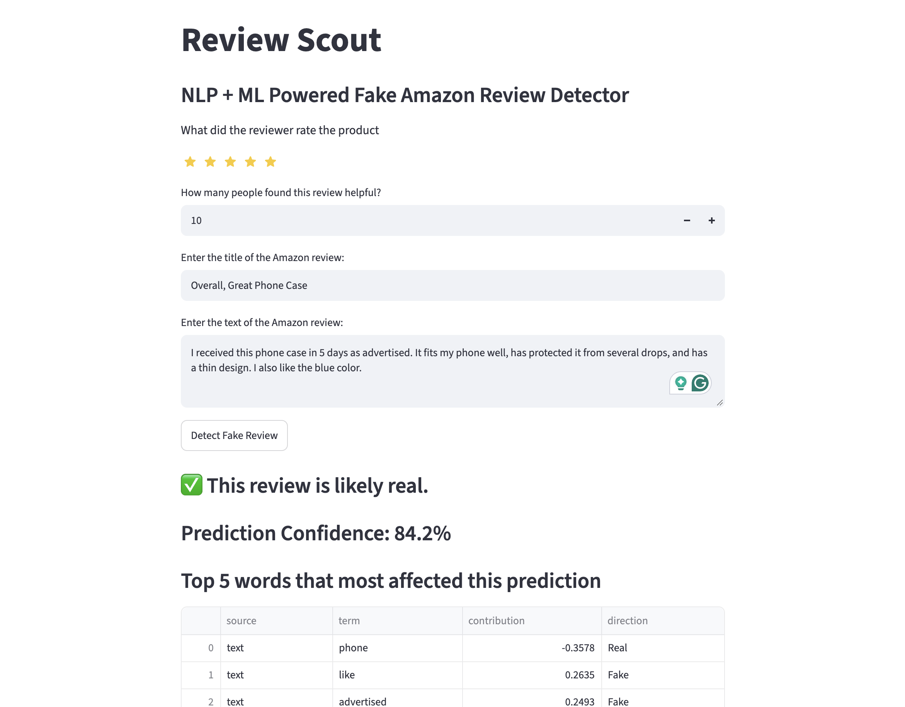
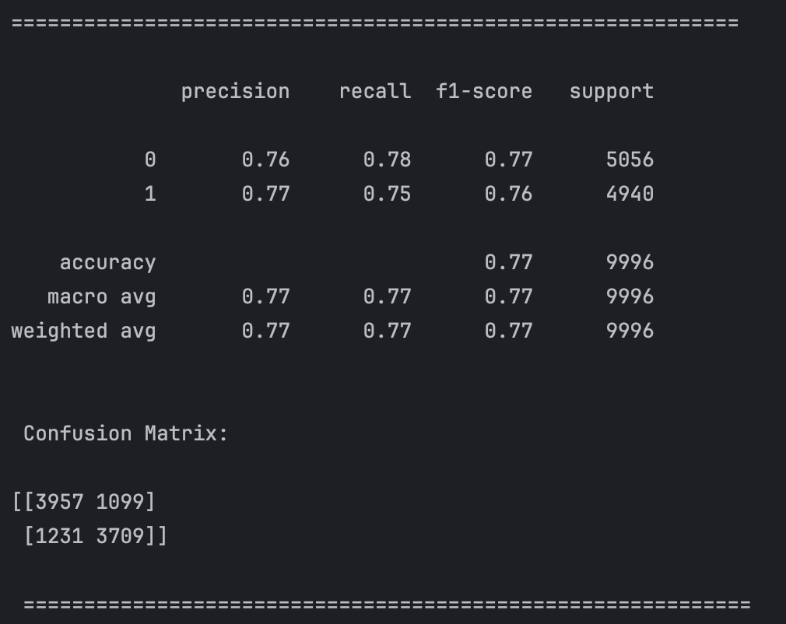

# Review Scout
> **Review Scout** is an NLP + ML powered app that can predict whether an Amazon review is real or fake.



## Project Description
**Review Scout** is a Streamlit app that utilizes natural language processing and machine
learning to predict whether an Amazon review is real or fake. **Review Scount** uses TF-IDF
Vectorizers to find the most important groups of characters, words, and groups of words in the
review's title and text corpus, and then uses a logistic regression model trained on these
features, along with several others including the review star rating to determine whether the inputted
review is real of fake. Along with the binary (1 is Fake and 0 is Real) prediction, Review Scout provides
the logistic regression model's confidence, as well as the top 5 most important TF-IDF terms that contributed
to the model's predictions.

## Table of Contents
- [Project Description](#project-description)
- [Features Overview](#features-overview)
- [Natural Language Processing Explaination](#natural-language-processing-explaination)
- [Machine Learning Explaination](#machine-learning-explaination)
- [Machine Learning Model Performance Evaluation](#machine-learning-model-performance-evaluation)
- [Docker Deployment](#docker-deployment)
- [UI Framework](#ui-framework)
- [Installation and Running](#installation-and-running)
- [Why I Built Review Scout and What I Learned](#why-i-built-review-scout-and-what-i-learned)
- [Contact Information](#contact-information)
- [References](#references)

## Features Overview
- Streamlit UI input elements that allow users to input the specific details of an Amazon review
- Streamlit UI that displays the logistic regression model's review prediction
- Streamlit UI that displays the logistic regression model's confidence and top 5 most important TF-IDF terms
- Docker Deployment


## Natural Language Processing Explaination
In the dataset used for this project (Amazon Labeled Fake Reviews Kaggle Dataset by MALIK_AWAIS_PY),
there are two features that contain corpuses of text; (Title and Text). The title feature represents
the review's title, and the text feature represents the review's text content. In this project, three
scikit-learn TF-IDF Vectorizers are used to turn this structured collection of text data into meaningful
inputs for the logistic regression ML model. The first two TF-IDF Vectorizers, called "title_vectorizer"
and "text_vectorizer", are used to find the most important unigrams and bigrams in the review's title and text corpus,
respectively. In this case, unigrams and bigrams are groups of one and two words respecitvely that are used
to help provide the ML model with context of how words in the text related to one another. The third TF-IDF
Vectorizer, called "text_char_vectorizer", works a little differently than the other two TF-IDF Vectorizers.
Instead of finding the most important unigrams and bigrams, it finds the most important groups of 3-5 characters
within an individual word. This helps improve the performance of the ML model by allowing its TF-IDF term features
to better capture the importance of words that are misspelled, which can be common in quickly written product reviews.

## Machine Learning Explaination
After preprocessing, feature engineering, and splitting the training and test sets of the dataset is completed,
the features are inputted into a scikit-learn logistic regression model for training. Logistic regression is a simple
classification ML algorithm that is used to predict a binary outcome. In this case the binary decision is whether a review
is real (0) or fake (1). While logistic regression is a simple algorithm that can't map every possible relationship like a
neural network can, it is a very interpretable algorithm. Logistic regression's interpretability was important in this project
because it allowed me to calculate the contribution of each TF-IDF term to the model's prediction by multiplying the model's
coefficient by the TF-IDF term's value. Also, when comparing the logistic regression model's performance to a scikit-learn SVC
model, it performed very similarly while requiring much less time and computation power to train.

## Machine Learning Model Performance Evaluation



To evaluate the performance of the logistic regression model, I used precision, recall, f1-score, support, and a confusion
matrix. The precision, recall, and f1-score values were moderate, all falling between 0.75 and 0.78. The support value was almost a 
50/50 split between classes 1 and 0. The training and test sets were mostly balanced because I used a stratified split, which preserves 
the ratio of the label classes in the training and test sets. According to the confusion matrix, the model was able to correctly predict 
3,957 out of 5,056 of the positive class (1) and 1,231 out of the 4,940 of the negative class (0) correctly.

## Docker Deployment
I used Docker to containerize this app. This makes it easy to build and run this application. All necessary steps to build and run
this app can be found in the Installation and Running section of this README.

## UI Framework
I used Streamlit to develop the frontend for this app as it provides a simple way to build informative, functional, and aesthetically pleasing
user interfaces. One thing to note with Streamlit is that it reruns the entire app.py script every time the UI is interacted with. This is why I
cached the model loading function "load_models." Otherwise, the models would be reloaded every time the app was run, which would unnecessarily 
slow the app's performance.

## Installation and Running
Review Scout can be run by using either Python or Docker. I recommend using Docker because it is the simplest way
to run this app if your primary goal is to use it and see its functionality.

### Prerequisites
- Either:
- **Python 3.13** and `pip` for native install, or
- **Docker** for a containerized install

### 1. Clone Repository
```bash
git clone https://github.com/nathanaspear-source/review-scout.git
cd review-scout
```

### 2. Running
- Option A: Run natively with Python
```bash
python -m venv venv
source venv/bin/activate              # macOS/Linux
# venv\Scripts\activate               # Windows PowerShell

pip install -r requirements.txt

# Trains the ML model
python -m ML_NLP.main

# Starts Streamlit app
venv/bin/python -m streamlit run app.py
```

- Option B: Run with Docker
```bash
# Run the following commands in the review-scout directory
docker build -t review-scout .
docker run -p 8501:8501 review-scout
```

## Why I Built Review Scout and What I Learned
I built this project as my entry in the Code Sprint competition hosted by the Computer Science Club
of Maryville University of St. Louis. This competition was a one week long individual "mini hackathon"
where participants developed a project of their choosing and submitted it for evaluation. I chose to build
a project focusing on NLP and ML because I enjoyed working with these subfields of AI in courses I have taken
at Maryville University, and I wanted to review these topics and apply my knowledge in a personal project outside
of homework. I also would like to pursue a career in AI and ML, and this project was a great way to demonstrate my
current skills in these areas.

## Contact Information
Built by [Nathan Spear](https://www.linkedin.com/in/nathan-spear-16b60b302/?lipi=urn%3Ali%3Apage%3Ad_flagship3_profile_view_base_contact_details%3Bee%2Bn30JASgmmntfzlrsW1g%3D%3D)

## References
### These are the sources I used to learn and review the NLP and ML topics necessary to complete this project. Also, the Kaggle dataset used for this project is cited in these references.

Aditya S. (2026, July 2). *Machines Understand Word Sequences*. Medium. https://medium.com/@s.aditya1317/n-grams-in-nlp-explained-how-machines-understand-word-sequences-980554511299

Argentini, M. (2026, February 11). *Better search results with character n-grams*. Fynydd. https://fynydd.com/blog/better-search-results-with-character-n-grams/

Gupta, M. (2025, July 11). *NLP | Custom corpus*. GeeksforGeeks. https://www.geeksforgeeks.org/nlp/nlp-custom-corpus/

Lee, F. (2025, May 14). *What is logistic regression?*. IMB Think. https://www.ibm.com/think/topics/logistic-regression

MALIK_AWAIS_PY. (n.d.). *Amazon Labeled Fake Reviews Dataset*. Kaggle. https://www.kaggle.com/datasets/malikawaispy/amazon-labeled-fake-reviews

Saha, R. (2026, July 2). *Understanding TF-IDF (Term Frequency-INverse Document Frequency)*. GeeksforGeeks. https://www.geeksforgeeks.org/machine-learning/understanding-tf-idf-term-frequency-inverse-document-frequency/

scikit-learn. (n.d.). *LogisticRegression*. https://scikit-learn.org/stable/modules/generated/sklearn.linear_model.LogisticRegression.html

scikit-learn. (n.d.). *TfidfVectorizer*. https://scikit-learn.org/stable/modules/generated/sklearn.feature_extraction.text.TfidfVectorizer.html

scikit-learn. (n.d.). *train_test_split*. https://scikit-learn.org/stable/modules/generated/sklearn.model_selection.train_test_split.html

W3 Schools. (n.d.). *SciPy Sparse Data*. https://www.w3schools.com/python/scipy/scipy_sparse_data.php
